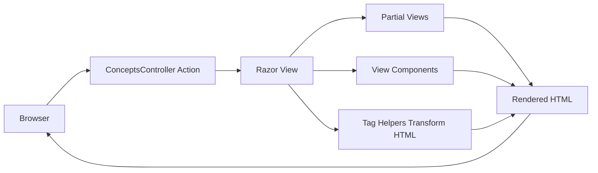

# ASP.NET Core Views Concepts (.NET 10)

This sample demonstrates four Razor view concepts in an ASP.NET Core MVC app:

1. Partial views
2. View components
3. Tag Helpers
4. General Razor view composition

## Where to look in the app

- Controller: `AspNetCoreViewsDemo.Web/Controllers/ConceptsController.cs`
- Partials demo: `Views/Concepts/Partials.cshtml`
- View components demo: `Views/Concepts/ViewComponents.cshtml`
- Tag Helpers demo: `Views/Concepts/TagHelpers.cshtml`
- Shared partials: `Views/Shared/_FeatureCard.cshtml`, `Views/Shared/_AlertBanner.cshtml`
- View component classes: `ViewComponents/*.cs`
- View component views: `Views/Shared/Components/*/Default.cshtml`
- Custom Tag Helper: `TagHelpers/ConceptCalloutTagHelper.cs`

## Documentation map

- [Partial views](./partial-views.md)
- [View components](./view-components.md)
- [Tag Helpers](./tag-helpers.md)
- [Razor view composition](./razor-views-overview.md)
- [Code concepts walkthrough](./code-concepts-walkthrough.md)

## Request and render flow

