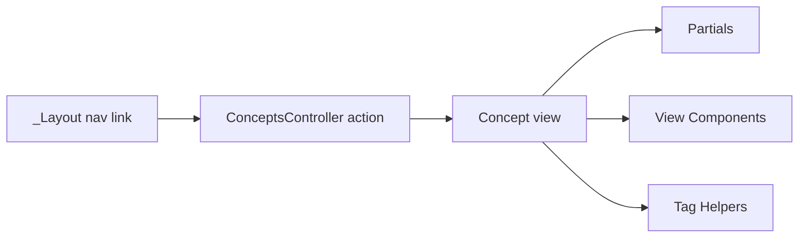

# Code Walkthrough: Where Each Concept Lives

This guide explains exactly how each concept is demonstrated in code so you can read the sample in a structured order.

## 1. Entry points and composition flow

Start here to understand navigation and page wiring:

- `AspNetCoreViewsDemo.Web/Views/Shared/_Layout.cshtml`
  - Top navigation links to all concept pages.
- `AspNetCoreViewsDemo.Web/Controllers/ConceptsController.cs`
  - Contains actions for `Partials`, `ViewComponents`, `TagHelpers`, and `Documentation`.
- `AspNetCoreViewsDemo.Web/Views/Concepts/Index.cshtml`
  - Landing page that introduces the concept demos.

## 2. Partial Views in code

Read these files together:

- `AspNetCoreViewsDemo.Web/Views/Concepts/Partials.cshtml`
  - Parent view that composes multiple partials.
- `AspNetCoreViewsDemo.Web/Views/Shared/_FeatureCard.cshtml`
  - Reusable strongly typed card partial.
- `AspNetCoreViewsDemo.Web/Views/Shared/_AlertBanner.cshtml`
  - Shared alert partial.
- `AspNetCoreViewsDemo.Web/Models/Demos/FeatureCardViewModel.cs`
- `AspNetCoreViewsDemo.Web/Models/Demos/AlertBannerViewModel.cs`
- `AspNetCoreViewsDemo.Web/Models/Demos/PartialsDemoViewModel.cs`

How it is explained by implementation:
- Controller builds the page model (`Partials` action).
- Parent view uses `@await Html.PartialAsync(...)`.
- Partials focus on presentation only.

## 3. View Components in code

Read these files together:

- `AspNetCoreViewsDemo.Web/ViewComponents/RecentArticlesViewComponent.cs`
- `AspNetCoreViewsDemo.Web/ViewComponents/StatusPanelViewComponent.cs`
- `AspNetCoreViewsDemo.Web/Views/Shared/Components/RecentArticles/Default.cshtml`
- `AspNetCoreViewsDemo.Web/Views/Shared/Components/StatusPanel/Default.cshtml`
- `AspNetCoreViewsDemo.Web/Services/IDemoContentService.cs`
- `AspNetCoreViewsDemo.Web/Services/DemoContentService.cs`
- `AspNetCoreViewsDemo.Web/Views/Concepts/ViewComponents.cshtml`

How it is explained by implementation:
- View components encapsulate data retrieval + rendering.
- Page invokes components via `Component.InvokeAsync(...)`.
- Services provide demo data independent of page action logic.

## 4. Tag Helpers in code

Read these files together:

- `AspNetCoreViewsDemo.Web/Views/Concepts/TagHelpers.cshtml`
  - Uses built-in helpers: `asp-controller`, `asp-action`, `asp-for`, `asp-items`, validation helpers.
- `AspNetCoreViewsDemo.Web/TagHelpers/ConceptCalloutTagHelper.cs`
  - Custom `concept-callout` Tag Helper.
- `AspNetCoreViewsDemo.Web/Views/_ViewImports.cshtml`
  - Registers built-in and custom Tag Helpers.
- `AspNetCoreViewsDemo.Web/Models/Demos/ContactFormInputModel.cs`
  - Data annotations drive validation helpers in the form.

How it is explained by implementation:
- Form and links are authored with Tag Helper attributes.
- Model validation messages are rendered declaratively in Razor.
- Custom helper demonstrates extending HTML-like tags with server behavior.

## 5. General Razor view composition

Read these files to see the complete layered approach:

- Layout: `AspNetCoreViewsDemo.Web/Views/Shared/_Layout.cshtml`
- Concept pages: `AspNetCoreViewsDemo.Web/Views/Concepts/*.cshtml`
- Shared partials: `AspNetCoreViewsDemo.Web/Views/Shared/_*.cshtml`
- View components: `AspNetCoreViewsDemo.Web/ViewComponents/*.cs`
- Component views: `AspNetCoreViewsDemo.Web/Views/Shared/Components/*/Default.cshtml`

Recommended reading order:

1. `ConceptsController.cs`
2. `Concepts/Index.cshtml`
3. `Concepts/Partials.cshtml` + shared partials
4. `Concepts/ViewComponents.cshtml` + view component classes/views + service
5. `Concepts/TagHelpers.cshtml` + custom Tag Helper + `_ViewImports.cshtml`
