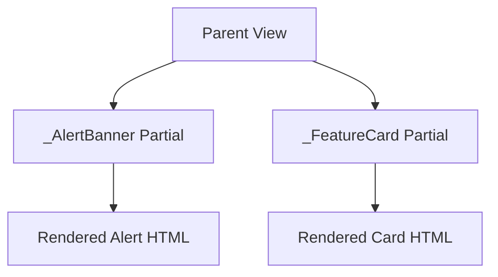

# Partial Views

Partial views are reusable Razor fragments for repeated markup.

## Demo references

- Page: `AspNetCoreViewsDemo.Web/Views/Concepts/Partials.cshtml`
- Shared partials:
  - `AspNetCoreViewsDemo.Web/Views/Shared/_FeatureCard.cshtml`
  - `AspNetCoreViewsDemo.Web/Views/Shared/_AlertBanner.cshtml`

## Why use them

- Keep repeated markup in one place
- Improve consistency across pages
- Keep parent views focused on composition

## Example usage

```cshtml
@await Html.PartialAsync("_FeatureCard", card)
```

## Composition model


