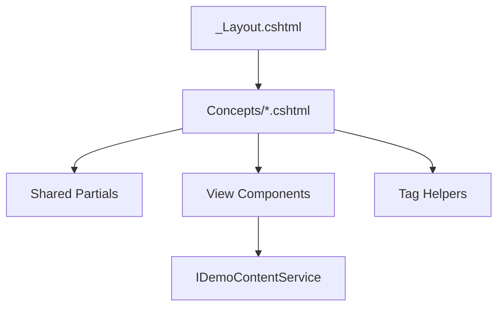

# Razor Views Composition Overview

This sample uses layered composition to keep UI code maintainable:

1. **Layout** for global chrome and navigation
2. **Page views** for feature-level screens
3. **Partial views** for shared presentational fragments
4. **View components** for reusable, data-backed UI blocks
5. **Tag Helpers** for route-safe links/forms and cleaner markup

## Key files

- Layout: `AspNetCoreViewsDemo.Web/Views/Shared/_Layout.cshtml`
- Home: `AspNetCoreViewsDemo.Web/Views/Home/Index.cshtml`
- Concepts landing: `AspNetCoreViewsDemo.Web/Views/Concepts/Index.cshtml`

## Composition diagram

