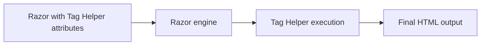

# Tag Helpers

Tag Helpers provide server-side behavior through HTML-like attributes in Razor views.

## Demo references

- Page: `AspNetCoreViewsDemo.Web/Views/Concepts/TagHelpers.cshtml`
- Custom Tag Helper: `AspNetCoreViewsDemo.Web/TagHelpers/ConceptCalloutTagHelper.cs`
- Registration: `AspNetCoreViewsDemo.Web/Views/_ViewImports.cshtml`

## Built-in helpers used

- `asp-controller` and `asp-action` for links
- `asp-for` for form controls and labels
- `asp-validation-for` and `asp-validation-summary` for validation
- `asp-items` for `<select>` options
- `<partial name="...">` for partial inclusion

## Custom helper used

`<concept-callout>` renders a Bootstrap-styled callout and supports a `tone` attribute.

```cshtml
<concept-callout title="Tag Helpers are the default authoring style here" tone="success">
    <p>...</p>
</concept-callout>
```

## Rendering concept


