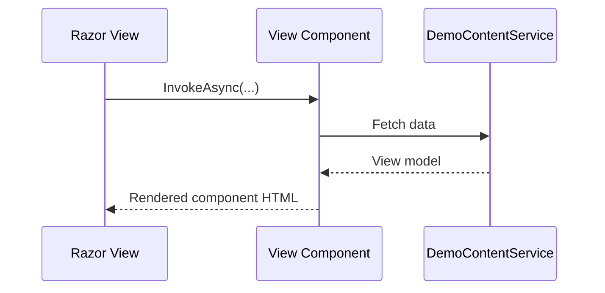

# View Components

View components are reusable rendering units that can prepare data independently from page actions.

## Demo references

- Page: `AspNetCoreViewsDemo.Web/Views/Concepts/ViewComponents.cshtml`
- Components:
  - `AspNetCoreViewsDemo.Web/ViewComponents/RecentArticlesViewComponent.cs`
  - `AspNetCoreViewsDemo.Web/ViewComponents/StatusPanelViewComponent.cs`
- Component views:
  - `AspNetCoreViewsDemo.Web/Views/Shared/Components/RecentArticles/Default.cshtml`
  - `AspNetCoreViewsDemo.Web/Views/Shared/Components/StatusPanel/Default.cshtml`

## Why use them

- Encapsulate both data preparation and rendering
- Reuse the same component in multiple pages
- Keep controllers and pages lean

## Example invocation

```cshtml
@await Component.InvokeAsync("RecentArticles", new { count = 3 })
```

## Data-backed rendering flow


